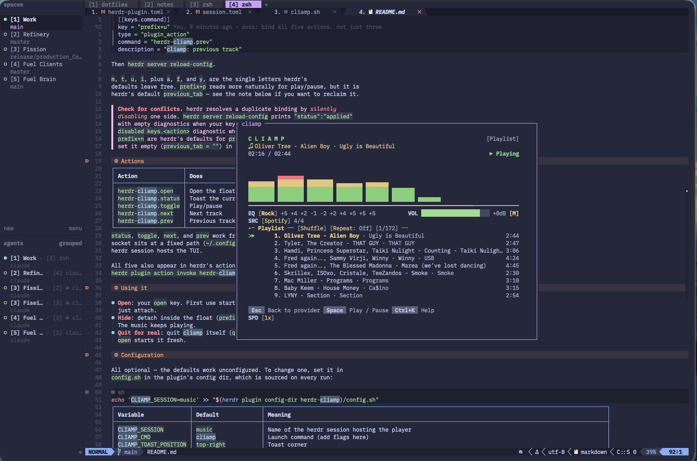
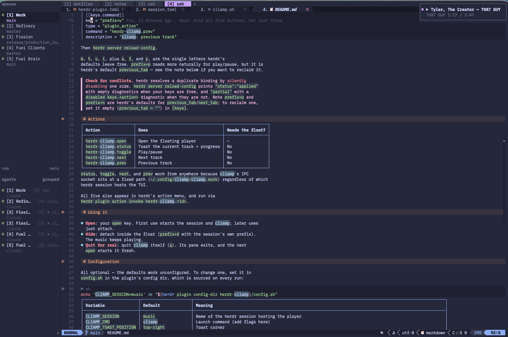

# herdr-cliamp

Control [cliamp](https://github.com/bjarneo/cliamp) — a terminal TUI for music,
podcasts, and audiobooks — from [herdr](https://herdr.dev), **without the music
stopping when you close the player**.

Press a key: cliamp floats in the middle of your screen. Press detach: the float
disappears and the audio keeps playing. Now-playing toasts and play/pause work
from any workspace without opening the float at all.

## Screenshots

The floating player over your work — press your `open` key, and detach to hide it
while the audio keeps going:



Now playing, without opening the float at all:



## The problem this solves

Cliamp keeps its audio player *inside* the TUI process. A normal floating pane
(herdr's `type = "popup"`, tmux's `display-popup`) runs a command and closes when
that command exits — so quitting the player would stop the music. Parking cliamp
in a regular tab works, but then it permanently occupies a tab, and closing that
tab kills playback too.

Instead, cliamp runs in its own **persistent herdr session**, and the floating
pane merely *attaches* to it. A herdr session's server keeps running with no
client attached, so:

- detaching hides the float and playback continues
- no tab is consumed in any of your working workspaces
- the player survives closing the float, switching workspaces, and detaching

## Requirements

- herdr **0.8.0+**
- `cliamp` on `PATH`
- `jq`, `python3`, `bash`
- `allow_nested = true` in your main herdr config (see Setup) — the float
  attaches to a herdr session from inside a herdr pane, which herdr blocks by
  default

## Install

```sh
herdr plugin install coryshaw1/herdr-cliamp
```

Or from a checkout:

```sh
git clone https://github.com/coryshaw1/herdr-cliamp
cd herdr-cliamp && herdr plugin link .
```

## Setup

**1. Allow nesting.** In `~/.config/herdr/config.toml`:

```toml
[experimental]
allow_nested = true
```

Without this, opening the float fails with *"nested herdr is disabled by
default"*.

**2. Bind the actions.** herdr plugins cannot declare keybindings, so add the
ones you want (adjust keys to taste). All five actions are listed here; the
transport ones are equally usable from herdr's action menu if you would rather
not spend keys on them.

```toml
  [[keys.command]]
  key = "prefix+m"
  type = "plugin_action"
  command = "herdr-cliamp.open"
  description = "cliamp: floating player"

  [[keys.command]]
  key = "prefix+M"
  type = "plugin_action"
  command = "herdr-cliamp.status"
  description = "cliamp: now playing"

  [[keys.command]]
  key = "prefix+i"
  type = "plugin_action"
  command = "herdr-cliamp.toggle"
  description = "cliamp: play/pause"

  [[keys.command]]
  key = "prefix+t"
  type = "plugin_action"
  command = "herdr-cliamp.next"
  description = "cliamp: next track"

  [[keys.command]]
  key = "prefix+u"
  type = "plugin_action"
  command = "herdr-cliamp.prev"
  description = "cliamp: previous track"
```

Then `herdr server reload-config`.

`m`, `t`, `u`, `i`, plus `a`, `f`, and `y`, are the single letters herdr's
defaults leave free. `prefix+p` reads more naturally for play/pause, but it is
herdr's default `previous_tab` — see the note below if you want to reclaim it.

> **Check for conflicts.** herdr resolves a duplicate binding by *silently
> disabling* one side. `herdr server reload-config` prints `"status":"applied"`
> with empty diagnostics when your keys are free, and `"partial"` with a
> `disabled keys.<action>` diagnostic when they are not. Note `prefix+p` and
> `prefix+n` are herdr's defaults for `previous_tab`/`next_tab`; to reclaim one,
> set it empty (`previous_tab = ""`) in `[keys]`.

## Actions

| Action | Does | Needs the float? |
|---|---|---|
| `herdr-cliamp.open` | Open the floating player | — |
| `herdr-cliamp.status` | Toast the current track + progress | No |
| `herdr-cliamp.toggle` | Play/pause | No |
| `herdr-cliamp.next` | Next track | No |
| `herdr-cliamp.prev` | Previous track | No |

`status`, `toggle`, `next`, and `prev` work from anywhere because cliamp's IPC
socket sits at a fixed path (`~/.config/cliamp/cliamp.sock`) regardless of which
herdr session hosts the TUI.

All five also appear in herdr's action menu, and run via
`herdr plugin action invoke herdr-cliamp.<id>`.

## Using it

- **Open**: your `open` key. First use starts the session and cliamp; later uses
  just attach.
- **Hide**: detach inside the float (`prefix+q` — herdr's default detach, with
  the float's own prefix, so `ctrl+b q` unless you give it a `[keys]` block).
  The music keeps playing.
- **Quit for real**: quit cliamp itself (`q`). Its pane exits, and the next
  `open` starts it fresh.

## Configuration

All optional — the defaults work unconfigured. To change one, set it in
`config.sh` in the plugin's config dir, which is sourced on every run:

```sh
echo 'CLIAMP_SESSION=music' >> "$(herdr plugin config-dir herdr-cliamp)/config.sh"
```

| Variable | Default | Meaning |
|---|---|---|
| `CLIAMP_SESSION` | `music` | Name of the herdr session hosting the player |
| `CLIAMP_CMD` | `cliamp` | Launch command (add flags here) |
| `CLIAMP_TOAST_POSITION` | `top-right` | Toast corner |
| `CLIAMP_MAIN_SOCKET` | main session socket | Where toasts are sent. Pointing this at the player session would render them where nobody can see them. |

### Keybindings inside the float

The player session loads its own small herdr config (`session.toml`), which sets
only the sidebar/tab-bar trim and `allow_nested`. It deliberately does not
declare `[keys]`, so it never overrides a preference of yours.

One consequence to know: `HERDR_CONFIG_PATH` *replaces* a config rather than
merging with one, so keys the plugin omits fall back to **herdr's defaults**, not
to your settings. Inside the float the prefix is therefore `ctrl+b`, and detach is
`ctrl+b q`. If your main prefix is also `ctrl+b`, give the float a `[keys]` block
with a different prefix so the two layers do not compete for the same key.

To make the float match your muscle memory, drop a `session.toml` into the plugin
config dir with your own `[keys]` block copied from your main config; it takes
precedence over the bundled one:

```sh
cat > "$(herdr plugin config-dir herdr-cliamp)/session.toml" <<'EOF'
[keys]
prefix = "ctrl+a"        # your prefix, and any other keys you want to match
detach = "prefix+q"      # herdr's default; use whatever you bind

[ui]
sidebar_start_collapsed = true
sidebar_collapsed_mode = "hidden"
hide_tab_bar_when_single_tab = true

[experimental]
allow_nested = true
EOF
```

Copy in whatever `[keys]` you use; keep the `[ui]` and `[experimental]` blocks,
since your file replaces the bundled one rather than extending it.

herdr has no config-include mechanism, so this is a copy: if you rebind keys
later, mirror the change here too.

## How it works

```
your session (default)                player session ("music")
┌──────────────────────────┐          ┌──────────────────────────┐
│ workspaces, tabs, panes  │          │ one pane: cliamp (exec)  │
│                          │          │ server runs with NO      │
│  ┌────────────────────┐  │ attach   │ client attached  ────────┼─► audio
│  │ floating overlay   │──┼─────────►│                          │
│  └────────────────────┘  │  detach  └──────────────────────────┘
└──────────────────────────┘
        ▲                                        │
        └──── toasts (main session socket) ──────┘
              status/toggle via cliamp.sock (fixed path)
```

`cliamp.sh` is the single entry point for every action. It keeps two sockets
straight: cliamp's fixed IPC socket (for playback state) and herdr's
*per-session* API socket — toasts must target the **main** session, or they
render in the hidden session where nobody can see them.

The session bootstrap is idempotent and self-healing: it restarts the session
server if stopped, recreates the workspace if the pane is gone, and launches
cliamp only when it is not already the pane's foreground process, then waits for
it to come up. That last check matters — cliamp is launched by typing into the
pane, so a check that wrongly says "not running" presses those characters as keys
in the running TUI, and cliamp is a singleton on its IPC socket: a second
instance would play over the first while answering for neither.

## Security notes

The plugin runs shell commands, so it is worth being explicit about what it
trusts:

- **`config.sh` is sourced**, so anything in it executes as you. That is how a
  shell config works, but it means the file is only as trustworthy as whoever can
  write it. It lives under `herdr plugin config-dir herdr-cliamp` and should stay
  writable only by your user.
- **`CLIAMP_CMD` is executed** in the player pane. Treat it as code, not data.
- **Values are never interpolated into hand-built JSON.** Requests to herdr's
  socket are assembled with proper escaping, so a value containing quotes or
  backslashes cannot alter the request it appears in.
- **No network access, no credentials.** The plugin talks only to two owner-only
  (`0600`) unix sockets — herdr's API socket and cliamp's IPC socket — and stores
  nothing.

None of this is a privilege boundary: an attacker who can already set your
environment or write your config files can run commands as you regardless of this
plugin. The escaping above is defence in depth, not a sandbox.

## Limitations

- **`allow_nested` is experimental** in herdr, by herdr's own labelling.
- **Radio metadata needs a recent cliamp.** Showing station + artist/song
  requires cliamp's IPC status to report `station` and resolve `title`/`artist`
  from the live ICY tag. Older builds send only the station name, and the toast
  degrades to that plus progress.
- **No auto-popping toasts on track change.** herdr cannot observe cliamp's
  internal events; the status action is pull-based. A cliamp Lua plugin hooking
  `track.change` could push them, but note `cliamp.exec.run()` passes only
  `PATH`/`HOME`/`LANG` to subprocesses, so it needs a wrapper that sets
  `HERDR_SOCKET_PATH` itself.
- **Linux/macOS only.**

## License

MIT
